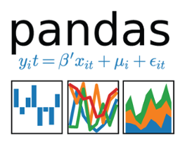

# CV, certificates and skills
## CV
[Long CV](https://javadebadi1990.github.io/CV/Javad-Ebadi-CV.pdf)

## Certificates
#### Programming
- **The Unix Workbench**. Johns Hopkins University, [Coursera](https://javadebadi1990.github.io/CV/certficates/The-Unix-Workbench.pdf)

#### Machine Learning Certificates
- **Machine Learning**, by Andrew Ng. Stanford University, [Coursera](https://javadebadi1990.github.io/CV/certificates/Machine-Learning-Coursera DJ4VL4Y4H2MD.pdf).

### Skills

<table border="0">
	<thead>
		<th></th>
		<th></th>
		<th></th>
                <th></th>
	</thead>
	<tr>
		<td><strong>Programming</strong></td>
                <td> C++</td>
		<td> Python</td>
		<td> Mathematica</td>
	</tr>
	<tr>
		<td><strong>Data Analysis</strong></td>
		<td><a href="https://root.cern.ch/"> root</a></td>
		<td><a href="https://pandas.pydata.org/"> pandas</a>    
			<a href="http://www.numpy.org/"> numpy</a>   
			<a href="https://matplotlib.org/"> matplotlib</a></td>
		<td></td>
	</tr>
	<tr>
		<td><strong>Machine Learning</strong></td>
		<td><a href="https://root.cern.ch/tmva"> TMVA</a></td>
		<td><a href="https://scikit-learn.org/"> scikit-learn</a> 
            <a href="http://keras.io/"> keras</a> 
            <a href="https://www.tensorflow.org/">  tensorflow</a>
        </td>
		<td></td>
	</tr>
</table>
